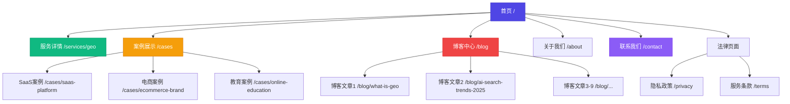
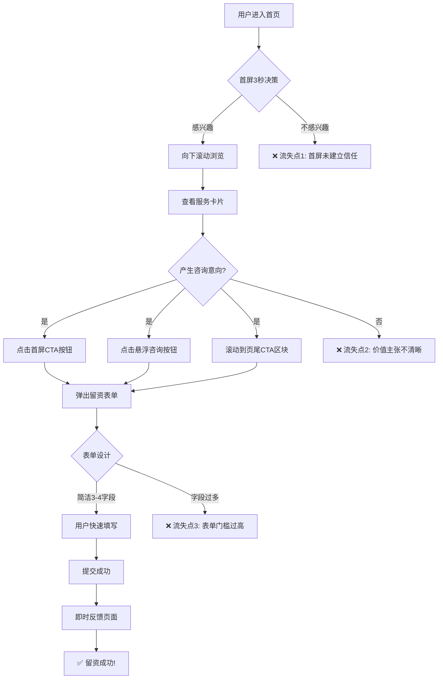
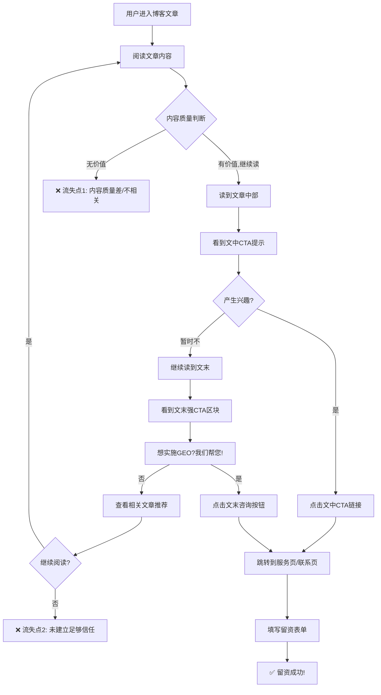
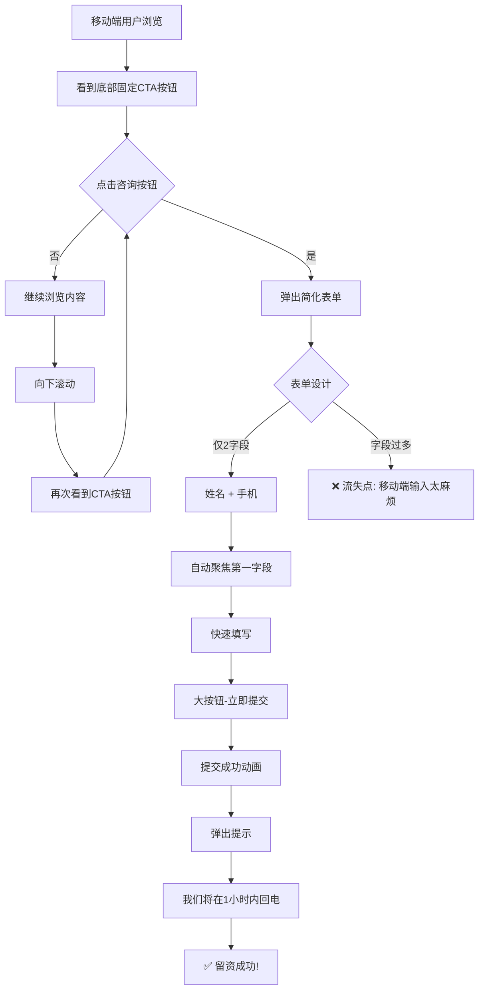

# 移山科技官网 UI/UX Specification

This document defines the user experience goals, information architecture, user flows, and visual design specifications for 移山科技官网's user interface. It serves as the foundation for visual design and frontend development, ensuring a cohesive and user-centered experience.

## Overall UX Goals & Principles

### Target User Personas

**主要用户(80%流量)：有GEO需求的企业决策者**
- **典型角色**: 市场总监、CMO、CEO、运营负责人
- **核心需求**: 在豆包、Kimi、DeepSeek、腾讯元宝等国内AI搜索中提升品牌曝光
- **行为特征**:
  - 正在研究GEO是什么、怎么做
  - 对比多家服务商,寻找靠谱合作伙伴
  - 需要看到案例证明和专业实力
- **留资动机**: 想咨询具体方案、获取报价、预约演示
- **决策周期**: 1-4周(从认知到咨询)

**次要用户(15%流量)：行业观察者**
- **典型角色**: 产品经理、内容负责人、SEO从业者
- **核心需求**: 学习GEO知识、了解行业趋势
- **行为特征**: 深度阅读博客内容,收藏页面
- **留资动机**: 可能是未来的决策者或内部推荐人
- **价值**: 建立品牌认知,培育潜在客户

**边缘用户(5%流量)：竞品/研究者**
- **行为**: 快速浏览后离开
- **策略**: 不作为核心设计对象

### Usability Goals

1. **3秒建立信任**
   - 首屏立即传达"专业GEO服务商"定位
   - 用权威数据/客户logo建立可信度
   - 目标: 让用户愿意继续浏览

2. **5分钟完成说服**
   - 用户在5分钟内理解GEO价值+看到成功案例+产生咨询意向
   - 关键页面(首页、服务页、案例页)流畅衔接
   - 目标: 形成"这家公司靠谱,我要咨询"的心理

3. **零摩擦留资体验**
   - 任何页面都能快速找到联系入口(悬浮按钮/页脚/CTA区块)
   - 表单简洁(只要核心信息),1分钟内填完
   - 提交后立即反馈,承诺24小时内回复
   - 目标: 降低留资门槛,提升转化率

4. **移动端同等体验**
   - 60%流量来自移动端,体验不打折扣
   - 移动端留资表单更简化(姓名+手机即可)
   - 一键拨打电话功能
   - 目标: 移动端转化率≥PC端

### Design Principles

1. **信任优先,步步为营** - 用数据、案例、客户评价建立信任,不急于推销,先提供价值(博客内容),在用户产生兴趣后再引导留资

2. **价值可视化,ROI说话** - 用具体数字展示效果(曝光提升X%、询盘增长X倍),案例中突出"投入→产出"的清晰逻辑,让用户看到"值得投资"的理由

3. **多层次CTA,不遗漏任何线索** - 首页主CTA(免费咨询) + 次CTA(查看案例),服务页每个服务后都有"了解更多/立即咨询",博客页文末引导"想实施GEO?联系我们",全站悬浮咨询按钮+页脚留资表单

4. **内容即营销,教育式转化** - 博客不只是展示专业,更是培育销售线索,用"问题→解决方案→案例→行动号召"的内容结构,让用户在学习过程中自然产生咨询需求

5. **极简交互,专注转化目标** - 避免花里胡哨的动效分散注意力,每个页面都有清晰的"下一步"引导,表单字段最小化,降低填写门槛

### Change Log

| Date | Version | Description | Author |
|------|---------|-------------|--------|
| 2025-01-20 | 1.0 | 初始版本创建 | UX Expert Sally |

---

## Information Architecture (IA)

### Site Map / Screen Inventory



### Navigation Structure

**Primary Navigation:**
- 位置: 顶部Header固定悬浮
- 结构: Logo | 首页 | GEO服务 | 成功案例 | 行业洞察 | 关于我们 | **[免费咨询]CTA按钮**
- 特点:
  - "免费咨询"按钮高亮显示(主色调背景)
  - 移动端收起为汉堡菜单
  - 滚动时Header背景变实,保持可读性

**Secondary Navigation:**
- **博客页内**: 分类筛选(全部 | GEO基础 | 行业趋势 | 案例分析 | 技术实践)
- **案例页内**: 行业筛选(全部 | SaaS | 电商 | 教育 | 其他)

**Breadcrumb Strategy:**
- 启用页面: 博客详情、案例详情、服务详情
- 格式: 首页 > 行业洞察 > 文章标题
- 目的: 帮助用户定位当前位置,提升SEO

**Floating Actions (转化关键!):**
- **右下角悬浮按钮**: "立即咨询"(点击展开联系方式或打开表单) - 全站可见
- **移动端**: 底部固定"免费咨询"按钮(始终可见,拇指可轻松点击)

**Footer Navigation:**
- 四列布局:
  1. **快速链接**: 首页、服务、案例、博客、关于
  2. **服务支持**: 联系我们、常见问题、隐私政策、服务条款
  3. **国内AI平台**: 豆包、Kimi、DeepSeek、腾讯元宝(展示专业领域)
  4. **联系方式**: 电话、邮箱、地址、工作时间

---

## User Flows (留资转化核心!)

### Flow 1: 首页快速留资流程 (冲动型转化)

**User Goal:** 快速了解服务并立即咨询

**Entry Points:**
- 搜索引擎/广告 → 首页
- 社交媒体分享 → 首页

**Success Criteria:** 用户在30秒内决定留资,填写表单<1分钟

#### Flow Diagram



#### Edge Cases & Error Handling:
- ❌ **流失点1优化**: 首屏必须在3秒内传达"我们是谁+能解决什么问题+值得信任"
- ❌ **流失点2优化**: 服务卡片要用"痛点→解决方案→数据证明"的结构,不要自嗨式描述
- ❌ **流失点3优化**: 表单只要3-4个字段(姓名、手机、公司、需求简述),移动端只要姓名+手机

**Notes:** 这是转化率最高但质量参差的流量,表单后要有人工筛选

---

### Flow 2: 博客阅读后留资流程 (教育型转化)

**User Goal:** 学习GEO知识后,对服务产生兴趣

**Entry Points:**
- 搜索引擎搜索GEO相关问题 → 博客文章
- 社交媒体分享 → 博客文章

**Success Criteria:** 用户读完文章,被内容说服,主动咨询

#### Flow Diagram



#### Edge Cases & Error Handling:
- ❌ **流失点1优化**: 博客内容必须解决用户真实问题,不要写自嗨的技术文章
- ❌ **流失点2优化**: 文末CTA区块要设计成"痛点回顾→我们的解决方案→立即行动",不是简单的"联系我们"

**Notes:** 这类用户质量高,转化周期长,需要培育多次触达

---

### Flow 3: 案例查看后留资流程 (信任型转化)

**User Goal:** 通过案例验证效果,建立信任后咨询

**Entry Points:**
- 首页案例区块 → 案例详情
- 独立访问案例页

**Success Criteria:** 用户看完案例,被ROI数据说服,发起咨询

#### Flow Diagram

```mermaid
graph TD
    A[用户进入案例页] --> B[浏览案例列表]
    B --> C[选择相关行业案例]
    C --> D[查看案例详情]

    D --> E[阅读客户背景]
    E --> F[查看遇到的挑战]
    F --> G{与自己情况相似?}
    G -->|不相似| H[返回选择其他案例]
    G -->|相似!| I[继续看解决方案]
    H --> C

    I --> J[查看详细效果数据]
    J --> K[ROI数据震撼?]
    K -->|一般| X1[❌ 流失点1: 案例数据不够亮眼]
    K -->|震撼!| L[查看客户评价]

    L --> M{我们也能做到?}
    M -->|有疑虑| N[查看服务流程]
    M -->|有信心| O1[点击案例内CTA]

    N --> O2[点击"了解如何实现"]

    O1 --> P[跳转留资页面]
    O2 --> P

    P --> Q[填写表单并备注]
    Q --> R[我的情况和XX案例类似]
    R --> S[✅ 留资成功!]
```

#### Edge Cases & Error Handling:
- ❌ **流失点1优化**: 案例数据必须用"实施前 vs 实施后"对比,突出ROI,不要模糊描述
- **关键优化**: 每个案例详情页都要有"您也想获得这样的效果?"的CTA区块

**Notes:** 这是质量最高的线索,说明用户已经完成内部决策,接近成交

---

### Flow 4: 移动端快速留资流程 (拇指操作优化)

**User Goal:** 移动端用户快速留下联系方式

**Entry Points:** 任何页面的移动端访问

**Success Criteria:** 拇指可轻松操作,30秒完成留资

#### Flow Diagram



#### Edge Cases & Error Handling:
- ❌ **流失点优化**: 移动端表单必须极简,只要姓名+手机,其他信息电话沟通时再收集
- **关键设计**: 底部CTA按钮固定在拇指可触及区域,不要放在顶部

**Notes:** 移动端转化率往往低于PC,必须极致简化流程

---

### 🔥 提升留资率的10个核心策略

1. **悬浮按钮必须有!** - 全站右下角固定,移动端底部固定
2. **表单字段越少越好!** - PC端最多4个,移动端只要2个
3. **每个页面都要有CTA!** - 不要指望用户主动找联系方式
4. **用恐惧+紧迫感!** - "您的竞品已经在豆包上被推荐了,您呢?"
5. **提交后立即反馈!** - "感谢!我们将在1小时内联系您"
6. **降低心理门槛!** - "免费咨询"比"立即购买"转化率高3倍
7. **案例数据要震撼!** - "询盘增长300%"比"效果显著"有用
8. **移动端体验优先!** - 60%流量来自手机,别让他们流失
9. **多个CTA入口!** - Header按钮、悬浮按钮、页尾表单、文中链接
10. **A/B测试优化!** - 不同的按钮文案、颜色、位置持续测试

---

## Wireframes & Mockups

**Primary Design Files:** 建议使用 Figma 或即时设计(国内工具)进行详细视觉设计

### 整体视觉风格定位

**清新简约派 - 大量留白,简洁干净**

- ❌ **不要**: 科技感渐变、深色背景、复杂纹理
- ✅ **要**: 大量留白、浅色系、清爽简洁、呼吸感

### 清新配色方案

**主色调: 清新蓝**
- Primary: #3B82F6 (蓝色,用于按钮、链接)
- Primary Light: #DBEAFE (浅蓝背景)

**辅助色: 温和绿(可选)**
- Success: #10B981 (绿色,用于数据正向指标)
- Success Light: #D1FAE5

**中性色(重点!)**
- 背景白: #FFFFFF
- 浅灰背景: #F9FAFB
- 边框灰: #E5E7EB
- 文字深灰: #1F2937 (标题)
- 文字中灰: #6B7280 (正文)
- 文字浅灰: #9CA3AF (辅助信息)

**强调色(谨慎使用)**
- 温和橙: #F59E0B (仅用于重要CTA)
- Warning: #FEF3C7 (浅黄背景,温和提示)

### 排版原则

1. **大量留白** - 区块间距至少80px,卡片内边距32px以上
2. **字号对比强烈** - H1:48-60px, H2:32-40px, H3:24-28px, 正文:16-18px
3. **线条极简** - 边框1px #E5E7EB,圆角6-12px
4. **图标风格** - 线条图标(Lucide Icons),单色,不要填充
5. **阴影极淡** - `box-shadow: 0 1px 3px rgba(0,0,0,0.1)` 或用细边框

### 按钮设计规范

**主按钮(Primary CTA):**
- 背景: #3B82F6 (清新蓝)
- 文字: 白色
- 圆角: 8px
- 内边距: 12px 32px
- Hover: #2563EB

**次按钮(Secondary):**
- 背景: 白色
- 边框: 1px solid #D1D5DB
- 文字: #6B7280
- Hover: 背景#F9FAFB

### Key Screen Layouts

#### 首页 (Homepage)

**Purpose:** 3秒建立信任 + 5分钟完成说服 + 引导留资

**Key Elements:**

**区块1: Hero区 (清新简约)**
- 背景: 纯白色 或 极浅米白(#FAFAFA)
- 标题(深灰#1F2937): "让您的品牌,在AI搜索中被优先推荐"
- 副标题(中灰#6B7280): "专注豆包、Kimi、DeepSeek、腾讯元宝等国内AI搜索优化"
- 主CTA按钮: 清新蓝(#3B82F6),"免费获取方案"
- 次CTA按钮: 白底边框,"查看成功案例"
- 客户logo墙(灰度处理)
- 背景装饰: 极简线条或完全纯白

**区块2: 服务价值区**
- 背景: 浅灰(#F9FAFB)与白色交替
- 白色卡片 + 极淡阴影,圆角12px
- 大量内边距(32px)
- 线条图标,单色
- 数据用清新蓝色高亮

**区块3: 数据统计区**
- 背景: 纯白
- 数字: 超大号,清新蓝(#3B82F6)
- 描述: 小字,灰色
- 大量留白

**区块4: 案例展示区**
- 白色卡片 + 细边框(#E5E7EB)
- 圆角8px
- 内容间距大

**区块5: CTA区块**
- 背景: 极浅蓝底(#EFF6FF)
- 白色输入框,细边框,圆角6px
- 大按钮,"立即获取免费方案"
- 承诺文案: "24小时内回复 | 信息严格保密"

**Interaction Notes:**
- Header滚动时固定,白色背景
- 悬浮咨询按钮(清新蓝)
- 移动端底部固定CTA(白色背景)

#### 服务详情页

**Purpose:** 深度说明GEO价值,解答"为什么要做GEO"

**Key Elements:**
- Hero区: 白色背景,标题+副标题
- 痛点区: 卡片式,不用红色警告,改用平静文案
- 解决方案: 时间线样式,清晰步骤
- 成果展示: 对比表格,视觉清晰
- FAQ: 手风琴样式
- CTA: 表单或电话

#### 案例详情页

**Purpose:** 真实数据建立信任

**Key Elements:**
- 客户logo + 核心数据(超大数字)
- 背景/挑战/方案/效果 清晰分区
- 对比表格: 优化前vs后
- 客户评价
- CTA: "您也想获得这样的效果?"

#### 博客详情页

**Purpose:** 提供价值,软性转化

**Key Elements:**
- 清晰排版,大间距
- 文中软性CTA(1/3, 2/3位置)
- 文末强CTA区块(浅色背景框)
- 相关文章推荐

#### 联系页面

**Purpose:** 多种联系方式,降低门槛

**Key Elements:**
- 电话/邮箱/微信(大号显示)
- 左侧表单,右侧信任背书
- 地址 + 地图

**Design File Reference:** 所有详细设计请在Figma中完成

---

## Component Library / Design System

**Design System Approach:** 基于Tailwind CSS构建,最小化组件集,清新简约风格

### Core Components

#### 1. Button (按钮)

**Purpose:** 所有CTA操作的载体

**Variants:** primary(清新蓝), secondary(白底边框), text(文字链接), danger(红色)

**States:** default, hover, active, disabled, loading

**Usage Guidelines:**
- 主按钮每个区块最多1个
- 文案用动词开头:"获取方案"、"查看案例"
- 移动端按钮至少44x44px

#### 2. Input (输入框)

**Purpose:** 收集用户信息

**Variants:** text, tel, email, textarea, select

**States:** default, focus, error, success, disabled

**Usage Guidelines:**
- 必填字段用红色*标记
- 错误提示在下方,红色小字
- 移动端高度至少48px

#### 3. Card (卡片)

**Purpose:** 展示服务、案例、博客

**Variants:** default(白色+细边框), hover(抬升), clickable

**Usage Guidelines:**
- 圆角8-12px
- 内边距至少32px
- 移动端宽度100%

#### 4. Modal (弹窗)

**Purpose:** 快速留资弹窗

**Variants:** small(400px), medium(600px), large(800px)

**Usage Guidelines:**
- 背景遮罩rgba(0,0,0,0.5)
- 右上角关闭按钮
- 移动端全屏或底部滑出

#### 5. Form (表单组)

**Purpose:** 留资核心组件

**Variants:** inline(单行), stacked(堆叠), grid(网格)

**States:** idle, validating, submitting, success, error

**Usage Guidelines:**
- PC端最多4字段,移动端最多2字段
- 成功后显示:"感谢!我们将在24小时内联系您"

#### 6. Badge (徽章)

**Purpose:** 标签展示

**Variants:** default(灰), primary(蓝), success(绿), warning(黄)

**Usage Guidelines:** 圆角4px, 字号12-14px, 内边距4px 8px

#### 7. Testimonial (客户评价卡)

**Purpose:** 信任背书

**Key Elements:** 客户头像(64x64px), 姓名+职位, 评价内容, 公司logo

**Usage Guidelines:** 评价不超过2-3行, 用引号包裹

#### 8. CTA Section (行动号召区块)

**Purpose:** 页面底部强转化

**Variants:** simple(标题+按钮), with-form(内嵌表单), full-width(全宽)

**Usage Guidelines:**
- 背景浅色(#EFF6FF)
- 内边距至少80px上下
- 每个页面都要有!

---

## Branding & Style Guide

**Brand Guidelines:** 移山科技品牌规范(清新专业风格)

### Color Palette

| Color Type | Hex Code | Usage |
|-----------|----------|-------|
| Primary | #3B82F6 | 主按钮、链接、重要元素 |
| Secondary | #10B981 | 成功状态、正向数据指标 |
| Accent | #F59E0B | 特殊强调、重要CTA |
| Success | #10B981 | 成功提示、正向反馈 |
| Warning | #FEF3C7 | 警告提示、温和提醒 |
| Error | #EF4444 | 错误提示、表单错误 |
| Neutral | #1F2937, #6B7280, #9CA3AF, #E5E7EB | 文字、边框、背景 |

### Typography

#### Font Families
- **Primary:** -apple-system, BlinkMacSystemFont, "Segoe UI", sans-serif (系统字体)
- **Chinese:** "PingFang SC", "Microsoft YaHei", sans-serif (中文优化)
- **Monospace:** "SF Mono", Monaco, monospace (代码展示)

#### Type Scale

| Element | Size | Weight | Line Height |
|---------|------|--------|-------------|
| H1 | 48-60px | 700 | 1.2 |
| H2 | 32-40px | 600 | 1.3 |
| H3 | 24-28px | 600 | 1.4 |
| Body | 16-18px | 400 | 1.6 |
| Small | 14px | 400 | 1.5 |

### Iconography

**Icon Library:** Lucide React (线条图标,清新风格)

**Usage Guidelines:**
- 使用线条图标,不要填充
- 图标大小: 20px(小), 24px(中), 32px(大)
- 颜色: 与文字颜色一致
- 图标与文字垂直居中对齐

### Spacing & Layout

**Grid System:** 12列网格系统(基于Tailwind CSS)

**Spacing Scale:** 4px基础单位
- xs: 8px
- sm: 16px
- md: 24px
- lg: 32px
- xl: 48px
- 2xl: 64px
- 3xl: 80px

---

## Accessibility Requirements

**Compliance Target:** WCAG 2.1 AA级别(Web内容无障碍指南)

### Key Requirements

**Visual:**
- 颜色对比度: 文字与背景至少4.5:1
- 焦点指示器: 蓝色边框,清晰可见
- 文字大小: 至少16px,可缩放至200%

**Interaction:**
- 键盘导航: Tab键可访问所有交互元素
- 屏幕阅读器: 所有图片有alt文本,表单有label
- 触摸目标: 移动端按钮至少44x44px

**Content:**
- 替代文本: 所有图片必须有alt属性
- 标题结构: 逻辑清晰的H1-H6层级
- 表单标签: 每个input必须有关联的label

### Testing Strategy
- 使用axe DevTools进行自动化测试
- 键盘导航测试(不使用鼠标完成所有操作)
- 屏幕阅读器测试(NVDA/VoiceOver)

---

## Responsiveness Strategy

### Breakpoints

| Breakpoint | Min Width | Max Width | Target Devices |
|-----------|-----------|-----------|----------------|
| Mobile | 0px | 767px | 手机 |
| Tablet | 768px | 1023px | 平板 |
| Desktop | 1024px | 1439px | 笔记本/台式机 |
| Wide | 1440px | - | 大屏显示器 |

### Adaptation Patterns

**Layout Changes:**
- Mobile: 单列布局,所有内容堆叠
- Tablet: 双列布局,部分内容并排
- Desktop: 多列布局,充分利用宽度
- Wide: 最大宽度1280px,居中显示

**Navigation Changes:**
- Mobile: 汉堡菜单,底部固定CTA
- Desktop: 横向导航,悬浮CTA按钮

**Content Priority:**
- Mobile优先显示核心内容和CTA
- 辅助信息可折叠或隐藏
- 保持相同的转化路径

**Interaction Changes:**
- Mobile: 大按钮(44x44px),触摸友好
- Desktop: 鼠标悬停效果,更丰富交互

---

## Animation & Micro-interactions

### Motion Principles
- **克制使用** - 动画服务于功能,不花哨
- **流畅自然** - 缓动函数ease-out,时长200-300ms
- **引导注意** - 用动画引导用户视线到CTA
- **反馈即时** - 按钮点击、表单提交有立即反馈

### Key Animations

- **按钮Hover:** 颜色渐变(200ms, ease-out)
- **卡片Hover:** 轻微抬升阴影(300ms, ease-out)
- **Modal打开:** 从中心放大+淡入(250ms, ease-out)
- **表单成功:** 绿色对勾动画(400ms, ease-in-out)
- **滚动进入:** 元素淡入+上移(500ms, ease-out,仅首次)
- **CTA呼吸:** 按钮轻微缩放脉冲(2s循环, ease-in-out)

---

## Performance Considerations

### Performance Goals
- **Page Load:** 首屏加载<2秒(LCP<2.5s)
- **Interaction Response:** 用户操作响应<100ms(FID<100ms)
- **Animation FPS:** 所有动画保持60fps

### Design Strategies
- 图片优化: 使用WebP格式,懒加载非首屏图片
- 字体优化: 预加载关键字体,使用字体子集
- 代码分割: 按页面拆分代码,减少初始加载
- 缓存策略: 静态资源长期缓存
- 避免布局偏移: 为图片预留空间,CLS<0.1

---

## Next Steps

### Immediate Actions

1. **设计师执行** - 在Figma中创建高保真设计稿
2. **开发准备** - 配置Tailwind主题,创建基础组件
3. **内容优化** - 检查现有文案,优化CTA文案
4. **留资表单优化** - 简化字段,测试提交流程
5. **移动端优化** - 重点测试移动端留资体验
6. **A/B测试计划** - 准备测试不同的CTA文案和按钮颜色

### Design Handoff Checklist

- [x] 所有用户流程已文档化
- [x] 组件清单完整
- [x] 无障碍要求已定义
- [x] 响应式策略清晰
- [x] 品牌指南已整合
- [x] 性能目标已建立

---

**文档完成!**

这份UI/UX规范聚焦于**提升留资转化率**,核心策略:
- ✅ 清新简约的视觉风格
- ✅ 多层次的CTA布局(悬浮、内嵌、页尾)
- ✅ 极简的留资表单(PC端4字段,移动端2字段)
- ✅ 清晰的用户留资流程(4种场景)
- ✅ 移动端优先体验

**下一步建议:**
1. 立即优化移动端留资表单(只要姓名+手机)
2. 全站添加悬浮咨询按钮
3. 案例页强化ROI数据展示
4. 博客页添加文末CTA区块

